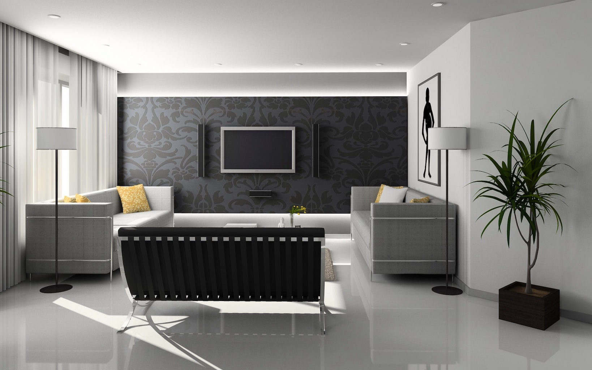

<section id="services" class="services-area pt-120">
  

    

      

        

          

          <h3 class="title">
            Välkommen till oss på D&S Måleri! Vi är ett förstklassigt
            måleriföretag med anor.
          </h3>
        

      

    

    

      

        

          

            
            
            <i class="lni-paint-roller"></i>
          

          

            <h4 class="services-title">Professionella</h4>
            

              Vi är stolta över att kunna säga att vi utför våra jobb enligt fackmässig skicklighet och precision.
            

          

        

      

      

        

          

            
            
            <i class="lni-ruler"></i>
          

          

            <h4 class="services-title">Kvalitet</h4>
            

              Vi är ett förstklassigt måleriföretag som garanterar arbeten med
              hög kvalitet.
            

          

        

      

      

        

          

            
            
            <i class="lni-service"></i>
          

          

            <h4 class="services-title">Service</h4>
            

              D&amp;S Måleri är ett fullserviceföretag som erbjuder
              totalåtagande åt företag och privatpersoner.
            

          

        

      

    

  

</section>

<section id="about" class="about-area pt-60">
  

    

      

        

          

            

            <h3 class="title">
              Lång erfarenhet inom måleribranchen
            </h3>
          

          

            Måleri är ett hantverk som vi har lång erfarenhet av. Vi värderar förarbetet vid varje målningsuppdrag eftersom det ger oss en bra grund för målningen. På D&amp;S Måleri målar vi alltid med noggrannhet för att ditt resultat ska bli av hög kvalité. Vår målarfirma hjälper gärna dig med färgval och kulör som kan passa i ditt hem i Malmö. Eftersom det finns många färgnyanser att välja mellan så kan vi hjälpa dig att välja rätt. Som kund hos oss får du goda råd men vi lyssnar alltid till dina önskemål. Om du söker professionella målare inför ditt nästa renoveringsprojekt så finns vi på D&S Måleri nära dig i Malmö!
          

        

      

      

        

          
        

      

    

  

  

    
  

</section>

<section class="about-area pt-60">
  

    
  

  

    

      

        

          

            

            <h3 class="title">Brett tjänsteutbud!</h3>
          

          

            Vi utför målningsarbeten både invändigt som utvändigt. Vi utför även
            renoveringar samt tapetsering invändigt. Nedan finner ni en del av tjänsterna som vi erbjuder, för en fullständig lista vänligen kontakta oss.
          

          <ul id="service-list">
            <li>Invändig målning</li>
            <li>Utvändig målning</li>
            <li>Trappuppgångar</li>
            <li>Tapetsering</li>
            <li>Fönsterrenovering</li>
            <li>Nybyggnadsmålning</li>
            <li>Ombyggnadsmålning</li>
            <li>Underhållsmålning</li>
            <li>Sprutspackling</li>
            <li>Sprutmålning</li>
            <li>med mera.</li>
          </ul>
        

      

      

        

          

            
            
            
            
            
            
            
            
            
            
            
            
            
            
            
            
          

        

      

    

  

</section>

<section class="about-area pt-60">
  

    
  

  

    

      

        

          

            

            <h3 class="title">Fönsterrenovering i Malmö</h3>
          

          

            En fönsterrenovering kan behövas när dina fönstren har börjat bli gamla, slitna eller trasiga. Nya fönster är ett effektivt sätt att skapa ett helt nytt intryck av ditt hem. En fönsterrenovering är en god investering eftersom den minskar dina uppvärmningskostnader från dag ett. Om du vill göra en fönsterrenovering i Malmö så kan vi på D&S Måleri hjälpa dig. Vi har många års erfarenhet av renoveringsprojekt, både stora och små. Under din fönsterrenovering fokuserar vi helhjärtat på dina fönster för att se till att resultatet blir så bra som möjligt. Efter många renoveringar av fönster i olika storlekar och skick har vi all kompetens som kan behövas för att ta oss an din fönsterrenovering i Malmö. Om du vill ha hjälp med din fönsterrenovering så är du välkommen att kontakta oss i Malmö. Vi hjälper dig med hela renoveringen, från början till slut.
          

        

      

      

        

          
        

      

    

  

</section>

<section class="about-area pt-60">
  

    

      

        

          

            

            <h3 class="title">Stora som små</h3>
          

          

            Våra kunder består av fastighetsägare, bostadsrättsföreningar,
            kommuner, industrier samt privatpersoner så vi tar oss an stora som
            små objekt. Vi tar oss an alla målningsuppdrag med samma engagemang och energi.
          

        

      

      

        

        
      

    

  

  

    
  

</section>

<section id="testimonial" class="testimonial-area pt-120">
  

    

      

        

          

          <h3 class="title">Det här har några av våra kunder att säga om oss</h3>
        

      

    

    

      
    

  

</section>
